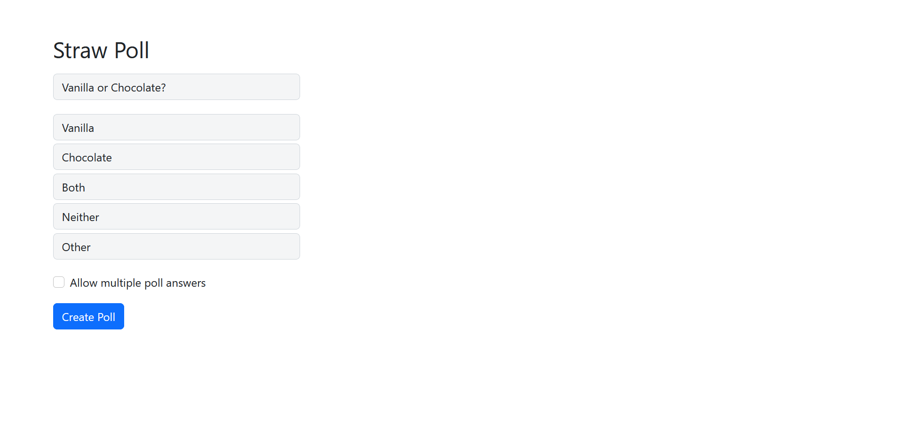

# Straw Poll Clone

## Introduction

[Straw Poll](https://strawpoll.me) is a website that's made for people to easily create and share [straw polls](https://en.wikipedia.org/wiki/Straw_poll). This project is a very minimal clone of that website as it only implements the logic of creating, reading, and updating polls, generating results, and being able to share polls to others via sharing links. I've deployed the application to Heroku, and you can visit it at https://straw-poll-clone.herokuapp.com.

As I've never made my own actual web application before, this is my first (I'd say quasi-full-stack since I'm not using a frontend framework) web development project. In the backend, I am using Python, Flask, and an SQLite database to store the polls. And in the frontend, I am only using HTML and CSS along with a few lines of JavaScript.

## Example

<div align="center">
  
  <p>The home page</p>
  
  <p>The vote page</p>
  
  <p>The results page</p>
</div>


## Requirements
- Python 3.9

## Dependencies
- Flask
- Flask-SQLAlchemy
- Flask-WTF
- gunicorn

## Getting Started

### After cloning the repository through Git or downloading the zip file, `cd` into it.

```
cd .\straw-poll-clone
```

### Create a virtual environment so the project's dependencies can be isolated from the rest of the modules installed on your machine

```
py -m venv venv
```

### Activate the virtual environment

```ps1
/venv/Scripts/activate
```

### Download the modules that are listed in `requirements.txt`

```ps1
pip install -r requirements.txt
```

### Run `app.py` to start the start the server.

```
py app.py
```

### Open a web browser and visit the following URL: `http://127.0.0.1:5000/`. This will take you to the home page where you can start using the web application on your machine.
